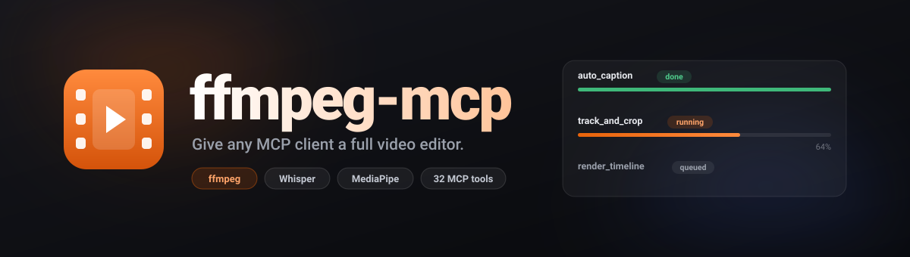
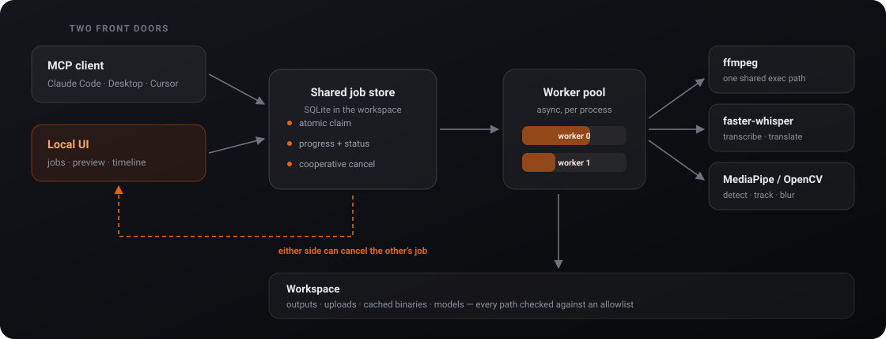
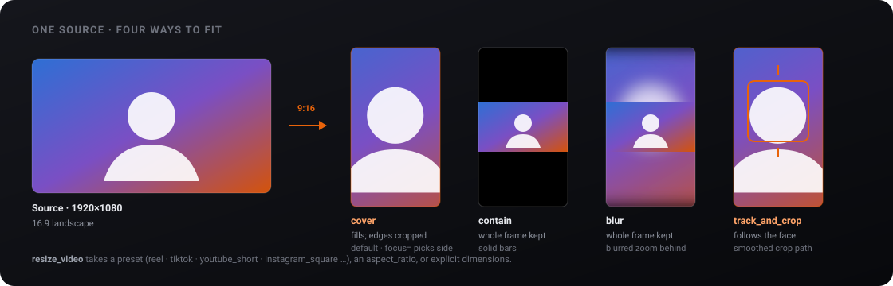

<p align="center">
  
</p>

<p align="center">
  
  
  
  
  
  
  <a href="LICENSE"></a>
</p>

<p align="center">
  Give any MCP client a real video editor —<br>
  <b>32 typed tools</b> over ffmpeg, Whisper and MediaPipe, plus an optional local UI
  with a <b>drag-and-drop timeline</b>.
</p>

<p align="center">
  <a href="#features">Features</a> &nbsp;·&nbsp;
  <a href="#quick-start">Quick start</a> &nbsp;·&nbsp;
  <a href="#how-it-works">How it works</a> &nbsp;·&nbsp;
  <a href="#reframing-for-reels-and-shorts">Reframing</a> &nbsp;·&nbsp;
  <a href="#the-tools">Tools</a> &nbsp;·&nbsp;
  <a href="#the-local-ui">Local UI</a> &nbsp;·&nbsp;
  <a href="#security">Security</a> &nbsp;·&nbsp;
  <a href="#license">License</a>
</p>

---

## Features

- **Typed tools, not a shell** — ffmpeg's editing surface arrives as 32 schema'd MCP tools, so the calling model gets parameters and guardrails instead of hand-writing filter graphs.
- **Nothing blocks** — anything that encodes frames returns a job id immediately, with real progress parsed from ffmpeg's own output and a cancel that actually kills the subprocess.
- **Zero setup** — finds your ffmpeg, or downloads a verified static build for your OS on first run. The Whisper and face models fetch themselves too.
- **Captions that survive their own text** — a subtitle containing `Time: 12:30, [note]; it's 50%` would corrupt a naively built filter graph. Here it doesn't, and there's a test proving it.
- **Sees faces** — detect them, follow one with a smoothed crop to turn landscape into vertical, or blur every face except your subject.
- **Hears speech** — Whisper transcription, translation, and one-shot auto-captioning with word-level timestamps.
- **Renders whole timelines** — clips, transitions, overlays, captions and ducked audio tracks compile into a single ffmpeg pass.
- **Two front doors, one backend** — the optional local UI shares the same job store, so it and your MCP client see and cancel each other's work.
- **Tested where it counts** — 651 tests; the 418 unit tests run with no ffmpeg installed at all.

## Quick start

```bash
uv sync --all-extras          # core + Whisper + vision + UI
uv run ffmpeg-mcp-server
```

Register it with your MCP client:

```json
{
  "mcpServers": {
    "ffmpeg-mcp": {
      "command": "uv",
      "args": ["run", "--directory", "/absolute/path/to/ffmpeg-mcp", "ffmpeg-mcp-server"]
    }
  }
}
```

Then just ask for what you want:

> *"Take `interview.mp4`, follow the speaker's face, make it a vertical Reel, and burn in captions."*

```
track_and_crop  →  job 8f3a…  ▸ done   interview_reframed.mp4
auto_caption    →  job b71c…  ▸ done   interview_reframed_captioned.mp4  + .srt
```

`probe_media` and `list_capabilities` answer instantly. Everything else returns a
job id — poll `job_status`, then `job_result`. `cancel_job` stops it mid-render.

## How it works

<p align="center">
  
</p>

Tools validate their arguments and enqueue; a worker pool picks the job up and
runs it. The job store is plain SQLite inside the workspace, which is what lets
the MCP server and the UI be **two processes over one queue** — either can
enqueue, either can watch progress, and either can cancel a job the other one
started, because cancellation is a cooperative flag the owning worker polls.

Every ffmpeg invocation goes through **one** async execution path that owns
timeouts, progress parsing and error wrapping. Arguments are always a list;
`shell=True` appears nowhere in the project.

## Reframing for Reels and Shorts

The most-asked-for edit, as one call. `resize_video` takes a named preset
(19 of them), an `aspect_ratio` like `9:16`, or explicit dimensions — and `fit`
decides what happens to the picture that no longer fits.

<p align="center">
  
</p>

```jsonc
{ "input_path": "talk.mp4", "preset": "reel",   "fit": "blur"  }   // blurred bars, nothing cropped
{ "input_path": "talk.mp4", "aspect_ratio": "1:1", "focus": "top" } // crop, keep the top
```

For a talking head that must stay in frame, prefer **`track_and_crop`** — it
follows the face and smooths the crop path, because a crop that snaps frame to
frame looks worse than a slightly imperfect one that glides.

## The tools

| | Area | Tools |
| :-: | :--- | :--- |
| 🎬 | **Core** | `probe_media` · `trim` · `concat` · `convert_format` · `transform` · `speed_ramp` · `list_capabilities` |
| ⏱ | **Jobs** | `job_status` · `job_result` · `cancel_job` · `list_jobs` |
| 🎨 | **Colour** | `color_grade` · `apply_lut` · `apply_curves` |
| 💬 | **Text** | `burn_captions` · `text_overlay` · `build_srt` |
| 🗣 | **Speech** | `transcribe_audio` · `auto_caption` · `translate_transcript` |
| 👤 | **Vision** | `detect_faces` · `track_and_crop` · `blur_faces` · `detect_scenes` |
| 🎞 | **Compose** | `add_transition` · `overlay_media` · `render_timeline` |
| 🔊 | **Audio** | `mix_audio` · `normalize_audio` · `fade_audio` |
| 📐 | **Format** | `resize_video` · `list_resolution_presets` |

<sub>Six tools are read-only and answer synchronously — <code>probe_media</code>, <code>list_capabilities</code>, <code>list_resolution_presets</code>, and the three job queries. The rest return a job id.</sub>

## The local UI

A separate process over the same workspace and job store — run it alongside the
MCP server, or entirely on its own.

```bash
uv run ffmpeg-mcp-ui          # http://127.0.0.1:8756
```

|     | Panel | What it does |
| :-: | :--- | :--- |
| 📊 | **Jobs** | Live queue pushed over a WebSocket, with progress bars and cancel. Jobs started by your MCP client appear here too. |
| ▶️ | **Preview** | Plays inputs and outputs in-browser, with a before/after view whose two players stay in step — grading and cropping are hard to judge from a still. |
| 🧰 | **Tools** | A form for every tool, generated from its JSON schema, so the list can never drift from what the tools accept. |
| ✂️ | **Timeline** | Drag clips to reorder, drag their edges to trim, scrub a playhead synced to the preview. Render emits exactly the structure `render_timeline` accepts. |
| 📥 | **Drop in** | Drag media from anywhere on your machine; it lands in the workspace and is immediately editable. |

<sub>Dark, glassmorphic, one orange accent. Built assets are committed, so running the UI needs no Node toolchain.</sub>

## Requirements

- Python 3.11 or 3.12 (managed with [`uv`](https://docs.astral.sh/uv/))
- ffmpeg 6+ — or let it download a static build on first run
- macOS, Linux, or Windows

## Configuration

Environment variables, all prefixed `FFMPEG_MCP_`:

| Variable | Default | Meaning |
| --- | --- | --- |
| `WORKSPACE` | `~/.ffmpeg-mcp/workspace` | Outputs, job store, cached binaries and models. |
| `ALLOWED_ROOTS` | `$HOME` | Roots that inputs and outputs must sit under. |
| `MAX_INPUT_BYTES` | 16 GiB | Rejects oversized inputs up front. |
| `MAX_JOB_SECONDS` | 10800 | Wall-clock cap per job. |
| `RETENTION_HOURS` | 24 | How long finished jobs and their files are kept. |
| `WORKER_CONCURRENCY` | 2 | Jobs running at once, per process. |
| `FFMPEG_PATH` / `FFPROBE_PATH` | — | Use specific binaries instead of resolving one. |
| `AUTO_DOWNLOAD` | `1` | Allow downloading a static ffmpeg build. |
| `WHISPER_MODEL` | `base` | `tiny` … `large-v3`, `turbo`. |
| `LOG_LEVEL` | `INFO` | |

### How ffmpeg is found

Configured path → build cached in the workspace → a system ffmpeg ≥ 6 → a
downloaded static build.

Builds from BtbN (Linux, Windows) are verified against the `checksums.sha256`
published with the release, and a mismatch is fatal. evermeet.cx (macOS)
publishes only a GPG signature and no digest, so macOS downloads are pinned on
first use — the hash is recorded in `<workspace>/bin/manifest.json` and any
later download of the same URL must match. Prefer to avoid that? Install ffmpeg
yourself and it'll be used instead.

The MediaPipe face model (~230 KB) is fetched on first vision call and verified
against a pinned SHA-256.

## Security

- **Path allowlist** — every input and output is resolved *through symlinks* before being checked, so a symlink in the workspace can't reach `/etc`.
- **No shell, ever** — ffmpeg arguments are always a list. `shell=True` appears nowhere.
- **Filter escaping, verified** — filter strings are built in one module applying both levels of ffmpeg's escaping. Overlay text goes to a sidecar file referenced with `textfile=` and `expansion=none`, so caption text never enters the graph at all.
- **Auditable** — every job records its resolved ffmpeg command line. File contents are never logged.
- **The UI is the same trust boundary** — on loopback it runs unauthenticated; bound anywhere else it generates and requires a token.
- **Uploads are rebuilt, not filtered** — the directory component is discarded (`../../etc/passwd` → `passwd`), the stem reduced to `[A-Za-z0-9._-]`, and the extension must be a media type the tools read.

## Development

```bash
uv run pytest                       # 651 tests
uv run pytest -m "not integration"  # 418 of them need no ffmpeg
uv run ruff check . && uv run ruff format --check .
uv run mypy
```

Unit tests cover the pure logic — filter builders and escaping, path validation,
the job store, SRT and LUT parsing, tracking geometry, timeline compilation.
Integration tests generate small fixture clips on first run and verify rendered
output by probing it.

Rebuilding the frontend:

```bash
cd ui-src && npm install && npm run build   # emits into src/ffmpeg_mcp/ui/static/
```

## Notes

`blur_faces` covers up to 12 tracked faces and says so when it truncates. A
missed detection means an unblurred face — review the output before publishing
anything sensitive.

## License

[MIT](LICENSE) © AbyAbyss.

ffmpeg itself is separately licensed, and the static builds this server can
download for you are GPL-configured. Those run as a **separate process** that
this project invokes over a command line — it links no ffmpeg code — so the MIT
terms above cover this codebase only. If you redistribute a bundle that ships an
ffmpeg binary alongside it, check that binary's own terms. Point
`FFMPEG_MCP_FFMPEG_PATH` at an LGPL build if you would rather avoid GPL
components entirely.
